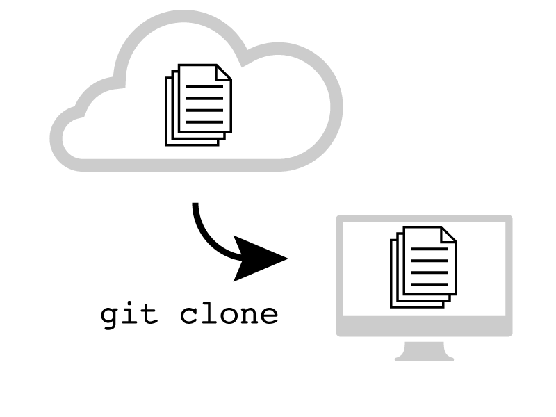

!SLIDE
> Welcome to
# Code Management
# for Designers
> Future of Web Design, NYC
> November 2011

!SLIDE
# Hi!

- I'm @jonathanpberger
- I make stuff at @pivotallabs
- I'm growing a mustache for charity

!SLIDE
# What it says on the tin
> "Become a more powerful designer by learning how to deploy your sites with Git and cloud hosting solutions like Heroku."

!SLIDE
# The Plan
- 40m to Speed through a *ton* of material.
- Try to show actual use and common workflows. No time to be exhaustive
- This will be a live-coded technical talk.

!SLIDE

- Act 1 - Solo Git & Heroku
- Act 2 - Team Git
- Act 3 - Setting-up, links to more
- I'm going to tell a story about [ping pong](http://www.pivotpong.com).

!SLIDE
# Act 1 - Solo Git
Copy an Open Source project for use.

!SLIDE
## Using Github
> [Github.com](http://www.github.com) is a web-based hosting service for projects that use the Git revision control system.

!SLIDE
## Copying a project with Git Clone
- First we'll fork the [Pivot Pong](https://github.com/seanmoon/pivot-pong) project.
- Then we'll take our fork and `git clone pivot-pong`.

!SLIDE

!SLIDE
## Making an edit
- Let's change the name of the app.

!SLIDE

!SLIDE
## Seeing what changed
- `git status`
- `git diff`

!SLIDE
## Commiting Changes
- `git commit -am`

!SLIDE

!SLIDE
## Distributed VCS
- This works if you're on the airplane(!)

!SLIDE
## Pushing code to the Repo
- `git status`
- `git log`
- `git push origin master`

!SLIDE

!SLIDE
## Let's try another
- Let's try running the app.
- Change the db.
- Change the styling.

!SLIDE
## Staging multiple files
- Let's use the GUI: GitX
- Each commit should be a unit of work.
- This isn't always a single file or single line.

!SLIDE

!SLIDE
## Deploying to the Web

!SLIDE
> "[Heroku](http://www.heroku.com) is a cloud application platform...[that] lets app developers spend 100% of their time on their application code, not managing servers, deployment, ongoing operations, or scaling."

!SLIDE
## Deploying with Heroku
- `heroku create`
- `git push heroku master`: deploy to new heroku instance
- `heroku rename`

!SLIDE
# Act 2 - Team Git

!SLIDE
## In which the A17 House Style is applied.

- My friend, Mr. FakeyPants didn't like the styling, so he made his own changes.
- I'll set him up as a collaborator on the site.
- I want to work on top of those.

!SLIDE
## Mr. Fakeypants Goes to Work
Mr. Fakeypants does: 

- In real life, he'd `git clone`, edit, `git commit`, `git push`, etc.
- For the purposes of this demo, we'll use GitHub's live edtiing feature.

!SLIDE
## I do some more work
- Makes changes and commits them (`git add`, `git ci`)
- `git push origin master`

!SLIDE
Oh noes! It breaks. Conflict!

!SLIDE

- I want to work on top of his changes
- First I have to `git rebase`
- **Now** I can `git push`

!SLIDE

- Push successfully.
- Deploy again to Heroku.

!SLIDE
# Act 3 - Setting-up

!SLIDE
# Trying this at home
You've seen me do it; here's what you need to do:

- To use git: Install Git on your machine using Homebrew.
- To backup and share: create a Github account, set up a remote repo
- To deploy to the web: set up a Heroku account
- Install `gem install heroku` to make deploying easier

!SLIDE
# The Links Slide:
- Install git using Brew **http://mxcl.github.com/homebrew/**
- Practice git basics with **http://gitimmersion.com/**
- Set up a Github account at **http://help.github.com/mac-set-up-git/**
- Set up a Heroku account at **http://devcenter.heroku.com/articles/quickstart**
- Use the Heroku Gem to make life easier at **https://github.com/heroku/heroku**
- My preferred "Brother Bard" Gitx branch at **https://github.com/brotherbard/gitx/downloads**
- GitX's page at **http://gitx.frim.nl/**

!SLIDE
## Some other fun stuff to explore:
This is intermediate git that I use every day:

- `git branch`
- `git blame`
- `git stash`
- `git reset HEAD^`
- resolving merge conflicts
- rubygems

!SLIDE
# For more info
- http://jonathanpberger.com/code_management
- Say hi at `@jonathanpberger`
- or `jonathanpberger` on github, gmail, forrst, etc...

!SLIDE
# Thanks!

!SLIDE
## Experiment safely
- `git branch`

!SLIDE
## Attribute changes to someone
- `git blame`

!SLIDE
## Quickly get back to a clean state
- `git stash`

!SLIDE
## Unstage your last few commits
- `git reset HEAD^`

!SLIDE
## resolving merge conflicts
- `git rebase --continue`

